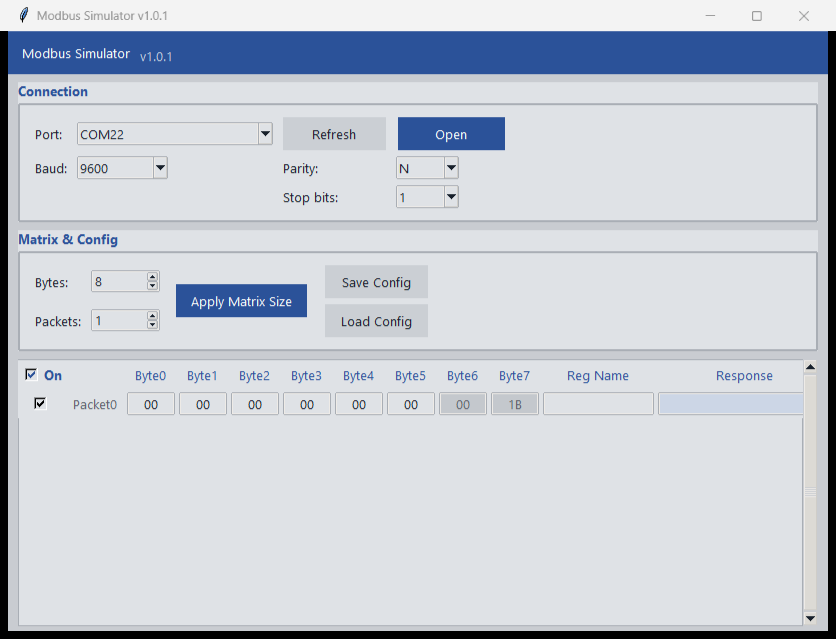

# Modbus Simulator

A Python/Tkinter desktop app for hand-crafting byte packets and sending them over a serial
port. Each packet is a row of bytes you type in a grid; the app appends a Modbus RTU CRC16
automatically and shows the slave's reply next to the packet that produced it.

Despite the name it is a **generic serial packet sender** — the only Modbus-specific behaviour
is the CRC16 and the way replies are captured.



## Features

- Pick a serial port from a dropdown, refresh the list, open/close it
- Configure baud (9600–115200), parity, stop bits
- **Packet matrix**: columns = bytes per packet, rows = packets, both resizable
- **CRC16 is automatic** — the last two byte columns of every row are read-only and recomputed
  as you type, low byte first
- **Per-packet "On" tick** — `Send All Checked` sends only the ticked packets; the header tick
  checks/unchecks all of them at once
- **Per-row Send button** — always sends that one packet, ticked or not
- **Response column** — the slave's reply as hex, per packet (blue on success, red when nothing
  came back)
- **Reg Name column** — a free-text note per row for your own reference; never transmitted
- Send once, or **Continuous** to loop with a configurable delay between passes
- Save/Load the whole setup (serial settings, matrix, notes, ticks) as JSON

## Requirements

- Python 3.8+
- [pyserial](https://pypi.org/project/pyserial/)
- A desktop session — this is a Tkinter GUI. It starts fine with no serial port attached
  (the port list is simply empty), you just can't send.

```
pip install -r requirements.txt
```

## Run

```
python serial_simulator.py
```

## Usage

### Entering bytes

Cells accept decimal (`10`), prefixed hex (`0x0A`), or bare hex (`0A`). Values must be `0..255`;
anything outside that range is reported as an error instead of being sent.

The **last two columns of every row are the CRC** — read-only, recalculated over that row's data
bytes on every keystroke. This is why `Bytes` has a minimum of 2.

A packet whose data bytes are **all zero** is treated as empty and skipped, so you can size the
matrix generously and only fill in the rows you need. (The CRC columns are excluded from that
check, since a CRC over zeros isn't itself zero.)

### Sending only some packets

Every row has an **"On"** tick, and new rows start ticked:

- **`Send All Checked`** sends only the ticked rows.
- The **header "On" tick** toggles every row at once, and shows as ticked only when all rows are.
- A row's own **`Send`** button ignores the tick entirely.

So to continuously hammer one register out of a full matrix: untick the header to clear
everything, tick the single packet you want, then `Send All Checked` with **Continuous** on. The
rest of the matrix stays one click away via each row's own `Send`.

### Timing

Within one pass, packets are spaced **100 ms** apart. In **Continuous** mode, the *Group delay*
(default 3000 ms) is applied after the whole group before the next pass begins.

Replies are read adaptively rather than by waiting for a fixed byte count: the app waits for the
first byte, then drains until the line has been idle ~30 ms. Sending is therefore paced by how
fast the slave actually answers.

`Send All Checked` takes a **snapshot** of the matrix. Edits and tick changes made during an
active continuous send do not affect the run in progress — press `Send All Checked` again to
restart from the current state. `Stop` ends it.

### Save/Load config

`Save Config` / `Load Config` store serial settings, matrix size, byte values, notes, and the
per-row ticks as JSON. CRCs are not saved — they are recomputed on load. Dialogs default to a
`ConfigFiles` folder next to the app. Configs saved before the "On" tick existed load with every
row ticked.

## Building a standalone .exe

```
python -m PyInstaller --onefile --windowed --name app --noconfirm serial_simulator.py
```

The result is `dist\app.exe`, double-clickable with no Python install required.

**Keep `app.exe` and its `ConfigFiles` folder together** — the app resolves that folder relative
to the executable, so saved configs follow the exe rather than getting lost in PyInstaller's temp
extraction directory.

If a previous `app.exe` is still running, close it first — PyInstaller can't overwrite a locked
file.

## Layout

Everything lives in `serial_simulator.py`: one `SerialSimulator(tk.Tk)` class plus a module-level
`compute_crc16_modbus()`. `CLAUDE.md` documents the internals — the matrix rebuild, CRC
auto-update, thread/UI marshalling, and the theme palette.
